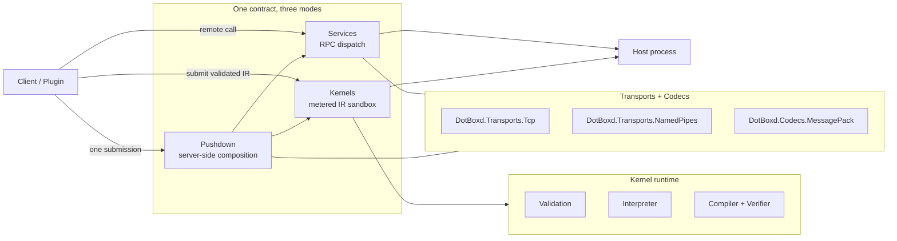

# DotBoxd

> Source-generated, contract-first .NET extension runtime: **Services**, **Kernels**, **Pushdown**.

[](https://github.com/JKamsker/DotBoxd/actions/workflows/ci.yml)
[](https://github.com/JKamsker/DotBoxd/actions/workflows/codeql.yml)
[](https://www.nuget.org/packages/DotBoxd)
[](LICENSE)
[](https://dotnet.microsoft.com/)

DotBoxd lets a host and its clients share **one C# contract** and use it in three different ways,
all driven by Roslyn source generators (no runtime reflection on the hot path):

- **Services** — the host implements a contract; clients call it remotely over RPC.
- **Kernels** — a client supplies validated logic the host runs safely inside a metered sandbox.
- **Pushdown** — a kernel composes the host's own services *server-side*, so many small remote
  calls collapse into one validated round-trip.

The Services and channel libraries target `netstandard2.1`, so they run on **Unity / IL2CPP**.
The Kernels and Pushdown stack targets `net10.0`.

---

## The 3 ways to use one contract

All three snippets below are distilled from the runnable acceptance sample at
[`samples/Pushdown/DotBoxd.EndToEnd`](samples/Pushdown/DotBoxd.EndToEnd) — they use the real,
compiling API.

### 1. Services — define a contract, host it, call it remotely

```csharp
using DotBoxd.Services.Attributes;

// One contract, shared by host and client.
[DotBoxdService]
public interface ICatalogService
{
    ValueTask<int> GetUnitPriceAsync(string itemId, CancellationToken cancellationToken = default);
    ValueTask<CartTotal> ComputeCartTotalAsync(Cart cart, CancellationToken cancellationToken = default);
}
```

```csharp
using DotBoxd.Kernels.Transport.Ipc;   // IPC helper (ships in DotBoxd.Pushdown.Services)
using DotBoxd.Services.Generated;       // generated ProvideCatalogService / Get<T>

// Host: turn every accepted connection into a peer that serves the contract.
await using var host = DotBoxdDotBoxdRpcMessagePackIpc.ListenNamedPipe(
    pipeName,
    peer => peer.ProvideCatalogService(new CatalogService(prices)));
await host.StartAsync();

// Client: connect and get a strongly typed proxy — calls go over the wire.
await using var connection = await DotBoxdDotBoxdRpcMessagePackIpc.ConnectNamedPipeAsync(pipeName);
var catalog = connection.Get<ICatalogService>();

var unitPrice = await catalog.GetUnitPriceAsync("sword"); // one remote round-trip
```

The `[DotBoxdService]` attribute drives the `DotBoxd.Services.SourceGenerator`, which emits a typed
proxy, a dispatcher, and the `ProvideCatalogService(...)` / `Get<ICatalogService>()` extensions at
compile time. The GameService sample shows the same model over **TCP** with bidirectional callbacks
(see [`samples/Services/GameService`](samples/Services/GameService)).

### 2. Kernels — run validated logic under a policy

A kernel is restricted JSON IR (never C#, IL, or arbitrary host calls). The host imports it,
validates it against a capability/resource policy, and executes it inside a fuel-metered sandbox.

```csharp
using DotBoxd.Hosting;
using DotBoxd.Kernels;

// A sandbox host with only the safe, pure bindings enabled.
var host = SandboxHost.Create(builder =>
{
    builder.AddDefaultPureBindings();
    builder.UseInterpreter();
});

// A policy is a hard budget: fuel, loop iterations, list length, capability grants.
var policy = SandboxPolicyBuilder.Create()
    .WithFuel(1_000_000)
    .WithMaxLoopIterations(10_000)
    .WithMaxListLength(10_000)
    .Build();

var module = await host.ImportJsonAsync(kernelJson);
var plan = await host.PrepareAsync(module, policy);

var input = SandboxValue.FromList(
    [.. subtotals.Select(SandboxValue.FromInt32)],
    SandboxType.I32);

var result = await host.ExecuteAsync(plan, "main", input);

if (result.Succeeded && result.Value is I32Value total)
{
    // A buggy or hostile kernel cannot run away with host resources:
    Console.WriteLine($"total={total.Value}, fuel burned={result.ResourceUsage.FuelUsed}");
}
```

### 3. Pushdown — compose host services next to the data

A naive client makes one remote call per cart line, then sums the results. With pushdown, the host
exposes a contract method that composes its **own** catalog data into the kernel's inputs and runs
the validated kernel server-side — so the client submits the whole cart in **one** round-trip.

```csharp
// Host side: ComputeCartTotalAsync composes catalog data, then runs the sandboxed kernel.
public async ValueTask<CartTotal> ComputeCartTotalAsync(Cart cart, CancellationToken ct = default)
{
    var subtotals = new int[cart.Lines.Length];
    for (var i = 0; i < cart.Lines.Length; i++)
        subtotals[i] = PriceOf(cart.Lines[i].ItemId) * cart.Lines[i].Quantity;

    // The summation runs inside the metered kernel, right next to the service.
    var (total, fuelUsed) = await _kernel.RunAsync(subtotals, ct);
    return new CartTotal(total, fuelUsed);
}

// Client side: one submission instead of N price lookups.
var pushdown = await catalog.ComputeCartTotalAsync(cart);
// Round-trip win: 4 remote calls -> 1 (pushdown).
```

In the end-to-end sample, a 4-line cart that takes **4 remote calls** the naive way collapses into
**1 round-trip** with pushdown, and both paths produce the identical total (575).

---

## Quick start

```bash
# Full net10.0 stack (Services + Kernels + Pushdown):
dotnet add package DotBoxd

# Unity / netstandard2.1 service bundle:
dotnet add package DotBoxd.Services.All

# Preview pushdown IPC addon (prerelease while upstream deps are prerelease):
dotnet add package DotBoxd.Pushdown.Services --prerelease
```

Then read [`docs/getting-started`](docs/getting-started/) for first-service, first-kernel, and
pushdown walkthroughs, or run the acceptance sample:

```bash
dotnet run -c Release --project samples/Pushdown/DotBoxd.EndToEnd
```

---

## Architecture



The generators (`DotBoxd.Services.SourceGenerator`, `DotBoxd.Plugins.Analyzer`) emit proxies,
dispatchers, and plugin factories at compile time. Diagnostics are namespaced `DBXS###` (services)
and `DBXK###` (kernels/plugins). See [`docs/index.md`](docs/index.md) for the full picture.

---

## Packages

| Package | Purpose | TFM | Stability |
|---------|---------|-----|-----------|
| `DotBoxd` | Meta-package: the full net10.0 stack (Services + Kernels + Pushdown) | net10.0 | Preview |
| `DotBoxd.Services.All` | Meta-package: service + Unity bundle | netstandard2.1 | Stable · **Unity/IL2CPP** |
| `DotBoxd.Services` | Contract attributes, `RpcPeer`/`RpcHost`, dispatch | netstandard2.1 | Stable · **Unity/IL2CPP** |
| `DotBoxd.Codecs.MessagePack` | MessagePack serializer for the wire format | netstandard2.1 | Stable · **Unity/IL2CPP** |
| `DotBoxd.Transports.Tcp` | TCP transport | netstandard2.1 | Stable · **Unity/IL2CPP** |
| `DotBoxd.Transports.NamedPipes` | Named-pipe transport (local IPC) | netstandard2.1 | Stable · **Unity/IL2CPP** |
| `DotBoxd.Services.SourceGenerator` | Roslyn generator for `[DotBoxdService]` proxies/dispatchers | netstandard2.0 | Stable |
| `DotBoxd.Abstractions` | Plugin-to-host authoring contracts (`[Plugin]`, `IEventKernel<TEvent>`) | net10.0 | Preview |
| `DotBoxd.Kernels` | IR model, policy model, resource metering, canonical hashing | net10.0 | Preview |
| `DotBoxd.Kernels.Validation` | Structural, type, effect, policy, binding validation | net10.0 | Preview |
| `DotBoxd.Kernels.Runtime` | Safe host bindings (files, time, random, logging, strings, math) | net10.0 | Preview |
| `DotBoxd.Kernels.Interpreter` | Direct IR execution backend | net10.0 | Preview |
| `DotBoxd.Kernels.Compiler` | Generated-runtime backend + persistent artifact cache | net10.0 | Preview |
| `DotBoxd.Kernels.Verifier` | Generated-assembly verifier | net10.0 | Preview |
| `DotBoxd.Kernels.Serialization.Json` | JSON IR importer/exporter + schema | net10.0 | Preview |
| `DotBoxd.Hosting` | Host-facing orchestration API (`SandboxHost`) | net10.0 | Preview |
| `DotBoxd.Hosting.Http` | HTTP GET binding, grant helpers, pinned transport | net10.0 | Preview |
| `DotBoxd.Plugins` | Host runtime that loads/validates/dispatches plugins | net10.0 | Preview |
| `DotBoxd.Plugins.Analyzer` | Generator + analyzer for local plugin packages | netstandard2.0 | Preview |
| `DotBoxd.Pushdown.Services` | MessagePack IPC addon that composes kernels with services | net10.0 | **Preview / prerelease** |

`DotBoxd.Pushdown.Services` is published on a **prerelease** channel while its upstream net10.0
dependencies are prerelease; stable release gates fail if it is included in a stable package set.

---

## Security: what is and isn't a boundary

DotBoxd is precise about its trust boundary — read this before deploying:

- **Safe mode is the real boundary.** A kernel is restricted IR that is validated, capability-gated,
  fuel/quota-metered, and (for compiled mode) verified before it runs. Users never supply C#, raw IL,
  CLR member names, assemblies, or arbitrary host calls.
- **Trusted-plugin mode is NOT a security boundary.** It loads normal .NET assemblies via
  `AssemblyLoadContext`, and **`AssemblyLoadContext` is not a sandbox** — loaded code has full CLR
  capabilities. Only use it for code you already trust.
- **Untrusted arbitrary .NET code must be out-of-process / OS-isolated.** In-process restrictions
  defend against accidental and many malicious-author attacks, but hard multi-tenant isolation
  requires a worker process, container, or OS-level boundary.

See [`SECURITY.md`](SECURITY.md) and [`docs/security`](docs/security/) for the threat model, the
three execution modes, and the capabilities/bindings model.

---

## Status & roadmap

DotBoxd merges the former standalone ShaRPC (RPC) and Safe-IR (kernel sandbox) repositories into one
contract-first runtime. The net10.0 Kernels/Pushdown stack is **preview**; the netstandard2.1
Services/channel stack is the more mature surface. Deferred work and known gaps are tracked in
[`docs/architecture/follow-up-issues.md`](docs/architecture/follow-up-issues.md).

## Contributing

Build, test, and the CI gate list live in [`CONTRIBUTING.md`](CONTRIBUTING.md). In short:

```bash
dotnet build DotBoxd.slnx -c Release
dotnet test  DotBoxd.slnx -c Release
```

Please read the [Code of Conduct](CODE_OF_CONDUCT.md). For how to view pre-merge history of the two
original repos, see
[`docs/contributing/migration-from-standalone-repos.md`](docs/contributing/migration-from-standalone-repos.md).

## License

DotBoxd is [MIT licensed](LICENSE). It preserves the attribution of both original projects:
**Copyright (c) 2026 Danial Jumagaliyev** (ShaRPC, the Services/channels stack) and
**Copyright (c) 2026 Jonas Kamsker** (Safe-IR / DotBoxd, the Kernels/Pushdown stack).
