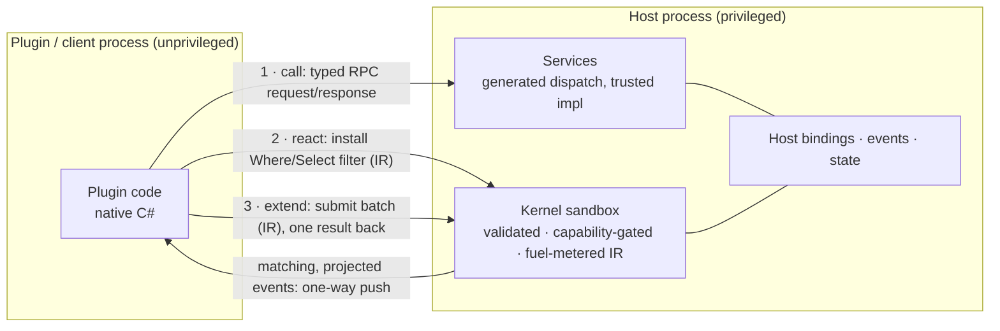

# DotBoxD

> Contract-first plugin development for .NET hosts. Three interaction modes - **call** (typed RPC),
> **react** (server-filtered events), **extend** (plugin-shipped batch operations) - and one
> validated, fuel-metered **sandbox** for plugin-authored logic that runs inside the host.

[](https://github.com/JKamsker/DotBoxD/actions/workflows/ci.yml)
[](https://github.com/JKamsker/DotBoxD/actions/workflows/codeql.yml)
[](https://www.nuget.org/packages?q=DotBoxD)
[](LICENSE)
[](https://dotnet.microsoft.com/)
[](https://dotboxd.kamsker.at/)

DotBoxD is a complete **plugin system for .NET hosts** - game servers, desktop apps, backend
services - that must run **untrusted third-party plugins** safely. Everything you author is plain,
contract-first C# (interfaces, records, attributes) that source generators turn into wiring, and
it ships the whole architecture: process isolation over IPC, transports, codecs, generated
proxies, event pipelines, plugin lifecycle, and the piece .NET itself doesn't give you - a safe
way to run plugin *logic* inside the host process.

**Why that last piece matters:** `AssemblyLoadContext` is not a security boundary, so untrusted
plugins must live in a sidecar process behind IPC. That is safe but costly: every interaction pays
a round-trip, and the host vendor has to design event-filter APIs blind. DotBoxD keeps the process
boundary and moves the plugin's *logic* (never its code) into the host: filters, projections, and
batches compile to restricted **kernel IR** (never C#/IL) that the host validates, capability-gates,
and fuel-meters before running next to its data. Full story in three diagrams:
[**Why DotBoxD?**](https://dotboxd.kamsker.at/why-dotboxd/)

📖 **Docs, tutorials, and API reference:** <https://dotboxd.kamsker.at/>

## Quick start

The opt-in tooling for pausing real server-executed kernels is covered in
[Remote kernel debugging](docs-site/src/content/docs/concepts/remote-kernel-debugging.md).

```bash
dotnet new console -n CatalogQuickstart
cd CatalogQuickstart
dotnet add package DotBoxD --prerelease   # full net10.0 stack; DotBoxD.Services.All = netstandard2.1/Unity bundle
```

Replace `Program.cs` with this complete file - it defines a contract, hosts it on a named pipe,
and calls it through the generated typed proxy:

```csharp
using DotBoxD.Pushdown.Services;        // RpcMessagePackIpc helper
using DotBoxD.Services.Attributes;      // [RpcService]
using DotBoxD.Services.Generated;       // generated ProvideCatalogService / Get<T>

// A unique pipe name, so parallel runs never collide.
var pipeName = $"dotboxd-quickstart-{Guid.NewGuid():N}";
var prices = new Dictionary<string, int> { ["sword"] = 120, ["shield"] = 80 };

// Host: turn every accepted connection into a peer that serves the contract.
await using var host = RpcMessagePackIpc.ListenNamedPipe(
    pipeName,
    peer => peer.ProvideCatalogService(new CatalogService(prices)));
await host.StartAsync();

// Client: connect and call the generated typed proxy. The client lives in the
// same process here to keep the demo to one file; the call still crosses the
// named pipe exactly like an out-of-process client would.
await using var connection = await RpcMessagePackIpc.ConnectNamedPipeAsync(pipeName);
var catalog = connection.Get<ICatalogService>();

var price = await catalog.GetUnitPriceAsync("sword");
Console.WriteLine($"sword costs {price}");

// The contract: one attribute, no base classes, no marshaling code.
[RpcService]
public interface ICatalogService
{
    ValueTask<int> GetUnitPriceAsync(string itemId, CancellationToken cancellationToken = default);
}

// The host-side implementation is plain C#.
public sealed class CatalogService(Dictionary<string, int> prices) : ICatalogService
{
    public ValueTask<int> GetUnitPriceAsync(string itemId, CancellationToken cancellationToken = default)
        => ValueTask.FromResult(prices[itemId]);
}
```

`dotnet run` prints `sword costs 120`. The same steps, with expected output at every checkpoint,
are in [Getting started](https://dotboxd.kamsker.at/getting-started/). To see every feature
working together, clone the repo and run the maintained end-to-end sample:

```bash
dotnet run -c Release --project samples/GameServer/Examples.GameServer.Server/Examples.GameServer.Server.csproj
```

## Three interaction modes

Every plugin interaction is one of three shapes. What differs is where the author's logic runs and
what crosses the wire:

| Mode | You author | Wire behavior | Typical use |
|------|-----------|---------------|-------------|
| **1 · Services (RPC)** - *call the host* | An `[RpcService]` interface; the host implements it, clients get a generated typed proxy. | Request → response; 1 round-trip per call. | Fetch a price, compute a total. |
| **2 · Event pipelines** - *react to the host* | A `Where`/`Select` chain over a host event; the filter runs **inside the host** as sandboxed IR. | One-way push of matching, projected events; 0 round-trips (a result terminal such as `RegisterLocal` returns one reply per match). | High-frequency event streams you need a slice of. |
| **3 · Pushdown** - *extend the host* | A `[ServerExtension]` batch method; it runs **inside the host** as sandboxed IR, looping the host's existing bindings. | One submission replaces N per-entity calls. | Chatty loops against a host that is frozen at release. |

Modes 2 and 3 compile to the same engine, the
[kernel sandbox](https://dotboxd.kamsker.at/concepts/kernels/) - validated, capability-gated,
fuel-metered IR, never loaded C#/IL. Mode 1 is a trusted, hand-written host implementation with no
sandbox involved.

**Mode 2 in five lines** (from the [GameServer sample](samples/GameServer); built end to end in
[the event-pipelines walkthrough](https://dotboxd.kamsker.at/tutorials/event-pipeline-runlocal/)):

```csharp
server.Hooks.On<MonsterAggroEvent>()
    .Where(e => e.Distance <= 4)                    // lowered: runs on the SERVER as verified IR
    .Select(e => e.MonsterId)                       // lowered: runs on the SERVER; projects one field
    .RunLocal(monsterId => calmedMonsters.Add(monsterId)); // native C#, runs in YOUR plugin process
```

SDK value objects can expose eligible public instance methods with shared host-binding defaults. The
receiver becomes argument zero, and ids derive from the prefix, method name, and parameter types:

```csharp
[HostBindingObject("host.player", "game.player.inventory.read",
                   SandboxEffect.Cpu | SandboxEffect.HostStateRead)]
public sealed record PlayerSnapshot(int Id, IReadOnlyList<int> ItemIds)
{
    public bool HasItem(int itemId) => ItemIds.Contains(itemId); // host.player.HasItem.i32

    [HostBindingIgnore]
    public string LocalLabel() => $"player:{Id}"; // remains local-only
}
```

**Mode 3, abridged** (the host is frozen and exposes only a fine-grained `bool Kill(int id)`
binding; the *plugin* ships the batch, and one round-trip replaces N):

```csharp
[ServerExtension("monster-killer", typeof(IMonsterKillerService))]
public sealed partial class MonsterKillerKernel
{
    public List<KillResult> KillMonsters(List<int> monsterIds, HookContext ctx)
    {
        var results = new List<KillResult>();
        foreach (var id in monsterIds)
            results.Add(new KillResult(id, ctx.Host<IGameWorld>().Kill(id))); // the host's EXISTING binding
        return results;
    }
}

// The host installs the plugin's generated kernel once under its service contract.
await server.RegisterServerExtensionAsync<IMonsterKillerService, MonsterKillerKernel>();

List<KillResult> killed = server.ServerExtension<IMonsterKillerService>().KillMonsters(ids); // 1 round-trip, not N
```

The full version - the host-side `[HostBinding]` declaration, capability gating, registration, and
how complex objects ride the IR `Record` type - is
[the Pushdown walkthrough](https://dotboxd.kamsker.at/tutorials/pushdown-server-extension/) and the
[Pushdown concept](https://dotboxd.kamsker.at/concepts/pushdown/); the design record lives in
[`docs/design/plugin-fluent-hooks-api/followups.md`](docs/design/plugin-fluent-hooks-api/followups.md).
The raw sandbox API underneath both modes (import → validate → execute under a fuel policy) is
public too - see [Kernels](https://dotboxd.kamsker.at/concepts/kernels/) for the smallest
end-to-end `SandboxHost`.

## Security: what is and isn't a boundary

DotBoxD distinguishes three **trust postures** - read this before deploying:

- **Safe mode is the real boundary.** A kernel is restricted IR that is validated,
  capability-gated, fuel/quota-metered, and (for compiled mode) verified before it runs. Users
  never supply C#, raw IL, CLR member names, assemblies, or arbitrary host calls.
- **Trusted-plugin mode is NOT a security boundary.** It loads normal .NET assemblies via
  `AssemblyLoadContext`, and **`AssemblyLoadContext` is not a sandbox** - loaded code has full CLR
  capabilities. Only use it for code you already trust.
- **Untrusted arbitrary .NET code must be out-of-process / OS-isolated.** In-process restrictions
  defend against accidental and many malicious-author attacks, but hard multi-tenant isolation
  requires a worker process, container, or OS-level boundary.

See [`SECURITY.md`](SECURITY.md) and
[Sandbox caveats](https://dotboxd.kamsker.at/security/sandbox-caveats/) for the threat model, the
three trust postures, and the capabilities/bindings model.

## Where to go next

| Your journey | Start here |
|--------------|------------|
| Get a verified end-to-end win | [Getting started](https://dotboxd.kamsker.at/getting-started/) |
| Understand the why and pick a mode | [Why DotBoxD?](https://dotboxd.kamsker.at/why-dotboxd/) · [Choosing a mode](https://dotboxd.kamsker.at/overview/) |
| RPC & Unity: typed calls between processes | [Tutorial 1: your first Service](https://dotboxd.kamsker.at/tutorials/first-service/) |
| Plugin author: react to events, ship batches | [Event pipelines walkthrough](https://dotboxd.kamsker.at/tutorials/event-pipeline-runlocal/) · [Pushdown walkthrough](https://dotboxd.kamsker.at/tutorials/pushdown-server-extension/) |
| Host integrator: expose bindings, set policy | [Host bindings](https://dotboxd.kamsker.at/concepts/host-bindings/) · [Kernel runtime](https://dotboxd.kamsker.at/concepts/runtime/) |
| See everything working together | [GameServer walkthrough](https://dotboxd.kamsker.at/examples/gameserver-walkthrough/) |
| Review the security model | [Sandbox caveats](https://dotboxd.kamsker.at/security/sandbox-caveats/) |

Features that older, removed samples used to demonstrate are tracked in
[the examples coverage-gaps page](https://dotboxd.kamsker.at/examples/coverage-gaps/).

## Architecture



Every arrow crossing the process boundary rides the channel layer
(`DotBoxD.Transports.Tcp` / `DotBoxD.Transports.NamedPipes` + `DotBoxD.Codecs.MessagePack` - all
standalone packages), and the sandbox executes IR on an interpreted backend or a verified compiled
backend. The generators (`DotBoxD.Services.SourceGenerator`, `DotBoxD.Plugins.Analyzer`) emit
proxies, dispatchers, and plugin factories at compile time. Diagnostics are namespaced `DBXS###`
(services) and `DBXK###` (kernels/plugins). See
[the docs overview](https://dotboxd.kamsker.at/overview/) for the full picture.

## Installing from NuGet

DotBoxD ships as two stacks. Install a meta-package, or any individual package with
`dotnet add package <PackageId> --prerelease`. Main-branch CI packages are published as
`0.1.0-ci.*` prereleases; omit `--prerelease` once you target a stable tag release.

For a focused host or plugin setup, install only the components you use:

```bash
dotnet add package DotBoxD.Hosting --prerelease
dotnet add package DotBoxD.Kernels.Serialization.Json --prerelease
dotnet add package DotBoxD.Hosting.Http --prerelease
dotnet add package DotBoxD.Plugins.Analyzer --prerelease
dotnet add package DotBoxD.Pushdown.Services --prerelease
```

### Services & channels stack - `netstandard2.1`, stable API

Runs on .NET 8/9/10 and Unity. Unity/IL2CPP deployments must use generated/static MessagePack DTO
formatters, root the generated registry, and validate their own IL2CPP build.

| Package | Purpose |
|---------|---------|
| [`DotBoxD.Services.All`](https://www.nuget.org/packages/DotBoxD.Services.All) | Meta-package: the service + channel bundle (AOT configuration required) |
| [`DotBoxD.Services`](https://www.nuget.org/packages/DotBoxD.Services) | Contract attributes, `RpcPeer`/`RpcHost`, dispatch, and the bundled source generator |
| [`DotBoxD.Codecs.MessagePack`](https://www.nuget.org/packages/DotBoxD.Codecs.MessagePack) | MessagePack serializer for the wire format (generated resolver required for AOT) |
| [`DotBoxD.Transports.Tcp`](https://www.nuget.org/packages/DotBoxD.Transports.Tcp) | TCP transport |
| [`DotBoxD.Transports.NamedPipes`](https://www.nuget.org/packages/DotBoxD.Transports.NamedPipes) | Named-pipe transport (local IPC) |

`DotBoxD.Services.SourceGenerator` is bundled inside `DotBoxD.Services` as an analyzer asset, not
published as a standalone package.

### Kernels & plugins stack - `net10.0`, preview

| Package | Purpose |
|---------|---------|
| [`DotBoxD`](https://www.nuget.org/packages/DotBoxD) | Meta-package: the full net10.0 stack (Services + Kernels + Pushdown) |
| [`DotBoxD.Abstractions`](https://www.nuget.org/packages/DotBoxD.Abstractions) | Plugin authoring contracts (`[Plugin]`, `IEventKernel<TEvent>`, `HookContext`) |
| [`DotBoxD.Kernels`](https://www.nuget.org/packages/DotBoxD.Kernels) | IR model, policy model, resource metering, canonical hashing |
| [`DotBoxD.Kernels.Validation`](https://www.nuget.org/packages/DotBoxD.Kernels.Validation) | Structural, type, effect, policy, binding validation |
| [`DotBoxD.Kernels.Runtime`](https://www.nuget.org/packages/DotBoxD.Kernels.Runtime) | Safe host bindings (files, time, random, logging, strings, math) |
| [`DotBoxD.Kernels.Interpreter`](https://www.nuget.org/packages/DotBoxD.Kernels.Interpreter) | Direct IR execution backend |
| [`DotBoxD.Kernels.Compiler`](https://www.nuget.org/packages/DotBoxD.Kernels.Compiler) | Generated-runtime backend + persistent artifact cache |
| [`DotBoxD.Kernels.Verifier`](https://www.nuget.org/packages/DotBoxD.Kernels.Verifier) | Generated-assembly verifier |
| [`DotBoxD.Kernels.Serialization.Json`](https://www.nuget.org/packages/DotBoxD.Kernels.Serialization.Json) | JSON IR importer/exporter (`JsonImporter`/`JsonExporter`) + schema |
| `DotBoxD.Kernels.Debugging.Clr` | Opt-in trusted Roslyn debug evaluators (unsafe by design) |
| [`DotBoxD.Hosting`](https://www.nuget.org/packages/DotBoxD.Hosting) | Host-facing orchestration API (`SandboxHost`: import, prepare, execute under policy) |
| [`DotBoxD.Hosting.Http`](https://www.nuget.org/packages/DotBoxD.Hosting.Http) | HTTP GET binding, grant helpers, pinned-transport policy validation |
| [`DotBoxD.Plugins`](https://www.nuget.org/packages/DotBoxD.Plugins) | Host runtime that loads, validates, and dispatches plugins (`PluginPackageJsonSerializer` reads the plugin-package JSON envelope) |
| [`DotBoxD.Plugins.Analyzer`](https://www.nuget.org/packages/DotBoxD.Plugins.Analyzer) | Generator + analyzer that turns `[Plugin]` kernels into package-backed plugins (`netstandard2.0`) |
| [`DotBoxD.Pushdown.Services`](https://www.nuget.org/packages/DotBoxD.Pushdown.Services) | MessagePack IPC addon that composes kernels with services (**prerelease**) |

`DotBoxD.Pushdown.Services` is published on a **prerelease** channel while its upstream net10.0
dependencies are prerelease; stable release gates fail if it is included in a stable package set.

### Common namespaces & key types

After installing, these are the entry points you'll reach for:

- `DotBoxD.Services`: `[RpcService]`, `RpcPeer` / `RpcHost`, and the generated `Provide{Service}` /
  `Get<TService>()` wiring.
- `DotBoxD.Hosting`: `SandboxHost`.
- `DotBoxD.Kernels.Serialization.Json`: `JsonImporter` / `JsonExporter`.
- `DotBoxD.Pushdown.Services`: the MessagePack IPC bridge that runs kernels next to host services.

## Status & roadmap

DotBoxD merges the former standalone ShaRPC (RPC) and Safe-IR (kernel sandbox) repositories into
one contract-first runtime. The netstandard2.1 Services/channels stack is the more mature surface;
the net10.0 Kernels/Pushdown stack is **preview**. Deferred work and known gaps are tracked in
[`docs/architecture/follow-up-issues.md`](docs/architecture/follow-up-issues.md).

## Contributing

Build, test, and the CI gate list live in [`CONTRIBUTING.md`](CONTRIBUTING.md). In short:

```bash
dotnet build DotBoxD.slnx -c Release
dotnet test  DotBoxD.slnx -c Release
```

Please read the [Code of Conduct](CODE_OF_CONDUCT.md). For how to view pre-merge history of the two
original repos, see
[Migration from standalone repos](https://dotboxd.kamsker.at/contributing/migration-from-standalone-repos/).

## License

DotBoxD is [MIT licensed](LICENSE). It preserves the attribution of both original projects:
**Copyright (c) 2026 Danial Jumagaliyev** (ShaRPC, the Services/channels stack) and
**Copyright (c) 2026 Jonas Kamsker** (Safe-IR / DotBoxD, the Kernels/Pushdown stack).
