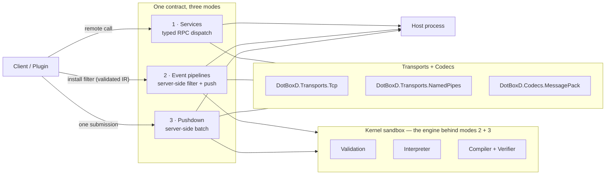

# DotBoxD

> Let third-party plugins extend your .NET app — without handing them your process.
> One C# interface gives you typed RPC, server-side-filtered events, and plugin-shipped batch
> operations, all generated at compile time. Untrusted plugin logic runs in a validated,
> fuel-metered sandbox.

[](https://github.com/JKamsker/DotBoxD/actions/workflows/ci.yml)
[](https://github.com/JKamsker/DotBoxD/actions/workflows/codeql.yml)
[](https://www.nuget.org/packages?q=DotBoxD)
[](LICENSE)
[](https://dotnet.microsoft.com/)
[](https://dotboxd.kamsker.at/)

DotBoxD is a complete **plugin system for .NET hosts** — game servers, desktop apps, backend
services — that must run **untrusted third-party plugins** safely. It ships the entire
architecture (process isolation over IPC, transports, codecs, generated proxies, event pipelines,
plugin lifecycle) plus the piece .NET itself doesn't give you: a safe way to run plugin *logic*
inside the host process.

📖 **Docs, tutorials, and API reference:** <https://dotboxd.kamsker.at/>

## Quick start

```bash
# Full net10.0 stack — Services, the kernel sandbox, and Pushdown:
dotnet add package DotBoxD --prerelease

# Or just the RPC stack (netstandard2.1 — works on .NET 8/9/10 and Unity):
dotnet add package DotBoxD.Services.All --prerelease
```

Then follow [Getting started](https://dotboxd.kamsker.at/getting-started/) — or clone the repo and
run the maintained end-to-end sample (a game server whose plugin filters events, reacts, and ships
its own server-side batch operation):

```bash
dotnet run -c Release --project samples/GameServer/Examples.GameServer.Server/Examples.GameServer.Server.csproj
```

## The problem

.NET cannot safely isolate arbitrary code **in-process**: AppDomains are gone, and
`AssemblyLoadContext` is a loading feature, **not** a security boundary. The only boundary the OS
truly enforces is a *process* — so untrusted plugins must run in their own unprivileged sidecar
process and talk to the host over IPC.

That safe design has two built-in costs:

1. **Round-trips.** Every interaction crosses the process boundary. A plugin that loops over
   N entities pays IPC latency N times.
2. **The filter-API dilemma.** Plugins only want a slice of the host's event stream, and someone
   has to filter it. But the host vendor — who is *not* the plugin author — must design that
   filter API blind. It always ends up either too coarse (oversharing plus overhead) or too
   exhaustive (endless unused options that are *still* not expressive enough).

## The idea

**Keep the process boundary. Move the plugin's *logic* — never its code — into the host.**

Plugin-authored filters, projections, and batches are compiled at build time into a restricted
intermediate representation called **kernel IR** — never C#, IL, or reflection. The host validates it,
gates every host call behind capabilities, meters it with a fuel budget, and only then runs it —
right next to the host's data. As a result:

- Event pipelines push only server-side filtered, projected data — **0 round-trips**.
- Pushdown collapses N calls into **1**.
- **The plugin author writes the filter**, not the host vendor.

The isolation-vs-latency dilemma in three diagrams:
[**Why DotBoxD?**](https://dotboxd.kamsker.at/why-dotboxd/)

## One contract, three modes

You write one C# contract. DotBoxD delivers it three ways — pick per call site:

| Mode | In one line | Round-trips | Typical use |
|------|-------------|-------------|-------------|
| **1 · Services (RPC)** — *call the host* | The host implements the interface; clients call a generated typed proxy. | 1 per call | Request/response: fetch a price, compute a total. |
| **2 · Event pipelines** — *react to the host* | Your `Where`/`Select` run **inside the host** as sandboxed IR; only matching, projected data is pushed to you. | 0 | High-frequency event streams you need a slice of. |
| **3 · Pushdown** — *extend the host* | Your batch method runs **inside the host** as sandboxed IR, looping the host's existing bindings. | 1, replacing N | Chatty per-entity loops against a host that is frozen at release. |

Modes 2 and 3 are powered by the same engine: the [kernel sandbox](#under-the-hood-the-kernel-sandbox).
Mode 1 is a trusted, hand-written implementation — no sandbox involved.

### 1 · Services — define a contract, host it, call it remotely

```csharp
using DotBoxD.Services.Attributes;

// One contract, shared by host and client.
[RpcService]
public interface ICatalogService
{
    ValueTask<int> GetUnitPriceAsync(string itemId, CancellationToken cancellationToken = default);
    ValueTask<CartTotal> ComputeCartTotalAsync(Cart cart, CancellationToken cancellationToken = default);
}
```

```csharp
using DotBoxD.Pushdown.Services;       // IPC helper
using DotBoxD.Services.Generated;       // generated ProvideCatalogService / Get<T>

// Host: turn every accepted connection into a peer that serves the contract.
await using var host = RpcMessagePackIpc.ListenNamedPipe(
    pipeName,
    peer => peer.ProvideCatalogService(new CatalogService(prices)));
await host.StartAsync();

// Client: connect and get a strongly typed proxy — calls go over the wire.
await using var connection = await RpcMessagePackIpc.ConnectNamedPipeAsync(pipeName);
var catalog = connection.Get<ICatalogService>();

var unitPrice = await catalog.GetUnitPriceAsync("sword"); // one remote round-trip
```

The `[RpcService]` attribute drives a Roslyn source generator that emits the typed proxy, the
dispatcher, and the `ProvideCatalogService(...)` / `Get<ICatalogService>()` extensions at compile
time — proxy and implementation cannot drift, and there is no runtime reflection on the hot path.

### 2 · Event pipelines — filter server-side, react where it fits

A plugin subscribes to a host event with an ordinary LINQ-style chain. The `Where`/`Select` are
*lowered* (compiled down) to kernel IR and run inside the host; only matching, projected values
ever cross the pipe (from the [GameServer sample](samples/GameServer)):

```csharp
server.Hooks.On<MonsterAggroEvent>()
    .Where(e => e.Distance <= 4)                    // lowered -> runs on the SERVER as verified IR
    .Select(e => e.MonsterId)                       // lowered -> runs on the SERVER; projects one field
    .RunLocal(monsterId => calmedMonsters.Add(monsterId)); // native C#, runs in YOUR plugin process
```

The plugin author writes the filter, the host never sees unvetted code, and non-matching events
never leave the host process. Other terminals let the reaction itself run server-side too — see
the [event pipelines tutorial](https://dotboxd.kamsker.at/tutorials/event-pipeline-runlocal/).

### 3 · Pushdown — plugins ship server-side batch operations

The host is typically **frozen at release** and exposes only fine-grained bindings (e.g. "kill
*one* monster"). With Pushdown, a plugin ships its *own* batch operation: the analyzer lowers the
plugin's C# batch method to verified kernel IR that runs server-side, looping over the host's
*existing* bindings. The server is never recompiled — and N round-trips collapse into one.

```csharp
// The host (frozen at release) exposes only a fine-grained binding — there is NO batch method here.
public interface IGameWorld
{
    [HostBinding("host.world.kill", "game.world.monster.write.kill",
                 SandboxEffect.Cpu | SandboxEffect.HostStateWrite)]
    bool Kill(int id);
}

// A PLUGIN adds its own batch aggregate. `KillMonsters` does not exist on the host — the plugin ships it.
// The analyzer lowers this method to verified, capability-gated, fuel-metered IR (a sandboxed kernel).
public interface IMonsterKillerService { List<KillResult> KillMonsters(List<int> monsterIds); }
public readonly record struct KillResult(int MonsterId, bool Success);

[ServerExtension("monster-killer", typeof(IMonsterKillerService))]
public sealed partial class MonsterKillerKernel
{
    public List<KillResult> KillMonsters(List<int> monsterIds, HookContext ctx)
    {
        var results = new List<KillResult>();
        foreach (var id in monsterIds)
            // ctx.Host<IGameWorld>() reaches the binding the host declared above — the call only
            // works because the host's policy grants the "game.world.monster.write.kill" capability.
            results.Add(new KillResult(id, ctx.Host<IGameWorld>().Kill(id)));
        return results;
    }
}

// Server installs the plugin's kernel; the caller invokes it in ONE round-trip:
await server.RegisterServerExtensionAsync<IMonsterKillerService, MonsterKillerKernel>();
List<KillResult> killed = server.ServerExtension<IMonsterKillerService>().KillMonsters(ids); // 1 round-trip, not N
```

Because the batch is author-supplied, it runs under the same trust model as every kernel: it can
reach only the host bindings the server already exposes (gated by
[capabilities](https://dotboxd.kamsker.at/concepts/host-bindings/) and fuel/quota limits), and it
can take and return complex objects and lists via the IR `Record` type. The full design lives in
[`docs/design/plugin-fluent-hooks-api/followups.md`](docs/design/plugin-fluent-hooks-api/followups.md).

### Under the hood: the kernel sandbox

*(Optional deep dive — skip on first read.)* Modes 2 and 3 both compile down to a **kernel** —
restricted JSON IR the host imports, validates against a policy, and executes under a hard budget.
This raw API is public too (the fluent layers above are opt-in sugar, never lock-in), and this
snippet compiles as-is:

```csharp
using DotBoxD.Hosting;
using DotBoxD.Kernels;

// A sandbox host with only the safe, pure bindings enabled.
var host = SandboxHost.Create(builder =>
{
    builder.AddDefaultPureBindings();
    builder.UseInterpreter();
});

// A policy is a hard budget: fuel, loop iterations, list length, capability grants.
var policy = SandboxPolicyBuilder.Create()
    .WithFuel(1_000_000)
    .WithMaxLoopIterations(10_000)
    .WithMaxListLength(10_000)
    .Build();

var module = await host.ImportJsonAsync(kernelJson);
var plan = await host.PrepareAsync(module, policy);

var input = SandboxValue.FromList(
    [.. subtotals.Select(SandboxValue.FromInt32)],
    SandboxType.I32);

var result = await host.ExecuteAsync(plan, "main", input);

if (result.Succeeded && result.Value is I32Value total)
{
    // A buggy or hostile kernel cannot run away with host resources:
    Console.WriteLine($"total={total.Value}, fuel burned={result.ResourceUsage.FuelUsed}");
}
```

Hosts can deliberately expose their own APIs to kernels through policy-gated
[host bindings](https://dotboxd.kamsker.at/concepts/host-bindings/).

## Security: what is and isn't a boundary

DotBoxD is precise about its trust boundary — read this before deploying:

- **Safe mode is the real boundary.** A kernel is restricted IR that is validated,
  capability-gated, fuel/quota-metered, and (for compiled mode) verified before it runs. Users
  never supply C#, raw IL, CLR member names, assemblies, or arbitrary host calls.
- **Trusted-plugin mode is NOT a security boundary.** It loads normal .NET assemblies via
  `AssemblyLoadContext`, and **`AssemblyLoadContext` is not a sandbox** — loaded code has full CLR
  capabilities. Only use it for code you already trust.
- **Untrusted arbitrary .NET code must be out-of-process / OS-isolated.** In-process restrictions
  defend against accidental and many malicious-author attacks, but hard multi-tenant isolation
  requires a worker process, container, or OS-level boundary.

See [`SECURITY.md`](SECURITY.md) and
[Sandbox caveats](https://dotboxd.kamsker.at/security/sandbox-caveats/) for the threat model, the
three execution modes, and the capabilities/bindings model.

## Where to go next

| You want to… | Start here |
|--------------|------------|
| Get an end-to-end win in ~10 minutes | [Getting started](https://dotboxd.kamsker.at/getting-started/) |
| Understand the why and pick a mode | [Why DotBoxD?](https://dotboxd.kamsker.at/why-dotboxd/) · [Choosing a mode](https://dotboxd.kamsker.at/overview/) |
| Typed RPC between processes (incl. Unity) | [Tutorial 1: your first Service](https://dotboxd.kamsker.at/tutorials/first-service/) |
| Plugins reacting to host events | [Tutorial 2: event pipelines](https://dotboxd.kamsker.at/tutorials/event-pipeline-runlocal/) |
| Plugin-shipped server-side batches | [Tutorial 3: Pushdown](https://dotboxd.kamsker.at/tutorials/pushdown-server-extension/) |
| See everything working together | [GameServer walkthrough](https://dotboxd.kamsker.at/examples/gameserver-walkthrough/) |
| Review the security model | [Sandbox caveats](https://dotboxd.kamsker.at/security/sandbox-caveats/) |

Features that older, removed samples used to demonstrate are tracked in
[the examples coverage-gaps page](https://dotboxd.kamsker.at/examples/coverage-gaps/).

## Architecture



The generators (`DotBoxD.Services.SourceGenerator`, `DotBoxD.Plugins.Analyzer`) emit proxies,
dispatchers, and plugin factories at compile time. Diagnostics are namespaced `DBXS###` (services)
and `DBXK###` (kernels/plugins). See [the docs overview](https://dotboxd.kamsker.at/overview/) for
the full picture.

## Packages

DotBoxD ships as two stacks. Install a meta-package, or any individual package with
`dotnet add package <PackageId> --prerelease`. Main-branch CI packages are published as
`0.1.0-ci.*` prereleases; omit `--prerelease` once you target a stable tag release.

### Services & channels stack — `netstandard2.1`, stable API

Runs on .NET 8/9/10 and Unity. Unity/IL2CPP deployments must use generated/static MessagePack DTO
formatters, root the generated registry, and validate their own IL2CPP build.

| Package | Purpose |
|---------|---------|
| [`DotBoxD.Services.All`](https://www.nuget.org/packages/DotBoxD.Services.All) | Meta-package: the service + channel bundle (AOT configuration required) |
| [`DotBoxD.Services`](https://www.nuget.org/packages/DotBoxD.Services) | Contract attributes, `RpcPeer`/`RpcHost`, dispatch, and the bundled source generator |
| [`DotBoxD.Codecs.MessagePack`](https://www.nuget.org/packages/DotBoxD.Codecs.MessagePack) | MessagePack serializer for the wire format (generated resolver required for AOT) |
| [`DotBoxD.Transports.Tcp`](https://www.nuget.org/packages/DotBoxD.Transports.Tcp) | TCP transport |
| [`DotBoxD.Transports.NamedPipes`](https://www.nuget.org/packages/DotBoxD.Transports.NamedPipes) | Named-pipe transport (local IPC) |

`DotBoxD.Services.SourceGenerator` is bundled inside `DotBoxD.Services` as an analyzer asset, not
published as a standalone package.

### Kernels & plugins stack — `net10.0`, preview

| Package | Purpose |
|---------|---------|
| [`DotBoxD`](https://www.nuget.org/packages/DotBoxD) | Meta-package: the full net10.0 stack (Services + Kernels + Pushdown) |
| [`DotBoxD.Abstractions`](https://www.nuget.org/packages/DotBoxD.Abstractions) | Plugin authoring contracts (`[Plugin]`, `IEventKernel<TEvent>`, `HookContext`) |
| [`DotBoxD.Kernels`](https://www.nuget.org/packages/DotBoxD.Kernels) | IR model, policy model, resource metering, canonical hashing |
| [`DotBoxD.Kernels.Validation`](https://www.nuget.org/packages/DotBoxD.Kernels.Validation) | Structural, type, effect, policy, binding validation |
| [`DotBoxD.Kernels.Runtime`](https://www.nuget.org/packages/DotBoxD.Kernels.Runtime) | Safe host bindings (files, time, random, logging, strings, math) |
| [`DotBoxD.Kernels.Interpreter`](https://www.nuget.org/packages/DotBoxD.Kernels.Interpreter) | Direct IR execution backend |
| [`DotBoxD.Kernels.Compiler`](https://www.nuget.org/packages/DotBoxD.Kernels.Compiler) | Generated-runtime backend + persistent artifact cache |
| [`DotBoxD.Kernels.Verifier`](https://www.nuget.org/packages/DotBoxD.Kernels.Verifier) | Generated-assembly verifier |
| [`DotBoxD.Kernels.Serialization.Json`](https://www.nuget.org/packages/DotBoxD.Kernels.Serialization.Json) | JSON IR importer/exporter (`JsonImporter`/`JsonExporter`) + schema |
| [`DotBoxD.Hosting`](https://www.nuget.org/packages/DotBoxD.Hosting) | Host-facing orchestration API (`SandboxHost`: import, prepare, execute under policy) |
| [`DotBoxD.Hosting.Http`](https://www.nuget.org/packages/DotBoxD.Hosting.Http) | HTTP GET binding, grant helpers, pinned-transport policy validation |
| [`DotBoxD.Plugins`](https://www.nuget.org/packages/DotBoxD.Plugins) | Host runtime that loads, validates, and dispatches plugins (`PluginPackageJsonSerializer` reads the plugin-package JSON envelope) |
| [`DotBoxD.Plugins.Analyzer`](https://www.nuget.org/packages/DotBoxD.Plugins.Analyzer) | Generator + analyzer that turns `[Plugin]` kernels into package-backed plugins (`netstandard2.0`) |
| [`DotBoxD.Pushdown.Services`](https://www.nuget.org/packages/DotBoxD.Pushdown.Services) | MessagePack IPC addon that composes kernels with services (**prerelease**) |

`DotBoxD.Pushdown.Services` is published on a **prerelease** channel while its upstream net10.0
dependencies are prerelease; stable release gates fail if it is included in a stable package set.

### Common namespaces & key types

After installing, these are the entry points you'll reach for:

- `DotBoxD.Services`: `[RpcService]`, `RpcPeer` / `RpcHost`, and the generated `Provide{Service}` /
  `Get<TService>()` wiring.
- `DotBoxD.Hosting`: `SandboxHost`.
- `DotBoxD.Kernels.Serialization.Json`: `JsonImporter` / `JsonExporter`.
- `DotBoxD.Pushdown.Services`: the MessagePack IPC bridge that runs kernels next to host services.

## Status & roadmap

DotBoxD merges the former standalone ShaRPC (RPC) and Safe-IR (kernel sandbox) repositories into
one contract-first runtime. The netstandard2.1 Services/channels stack is the more mature surface;
the net10.0 Kernels/Pushdown stack is **preview**. Deferred work and known gaps are tracked in
[`docs/architecture/follow-up-issues.md`](docs/architecture/follow-up-issues.md).

## Contributing

Build, test, and the CI gate list live in [`CONTRIBUTING.md`](CONTRIBUTING.md). In short:

```bash
dotnet build DotBoxD.slnx -c Release
dotnet test  DotBoxD.slnx -c Release
```

Please read the [Code of Conduct](CODE_OF_CONDUCT.md). For how to view pre-merge history of the two
original repos, see
[Migration from standalone repos](https://dotboxd.kamsker.at/contributing/migration-from-standalone-repos/).

## License

DotBoxD is [MIT licensed](LICENSE). It preserves the attribution of both original projects:
**Copyright (c) 2026 Danial Jumagaliyev** (ShaRPC, the Services/channels stack) and
**Copyright (c) 2026 Jonas Kamsker** (Safe-IR / DotBoxD, the Kernels/Pushdown stack).
