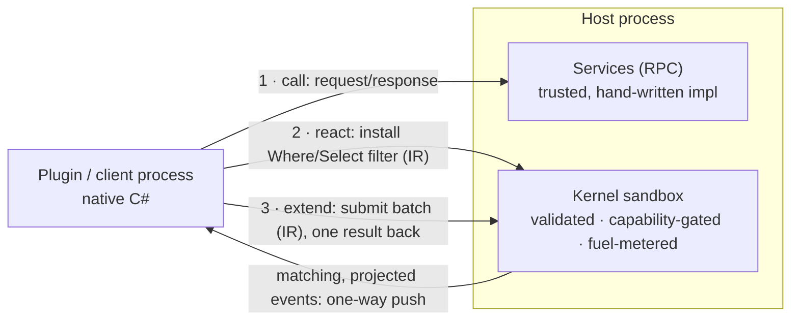

DotBoxD is a source-generated, contract-first **plugin system for .NET hosts**. Everything in it
hangs off one mental model:

> **Contract-first. Three interaction modes: call, react, extend. One sandbox.**

Everything you author is plain, contract-first C# - interfaces, event records, attributes - that
source generators turn into wiring. Every plugin interaction is one of three modes, and the two
modes that run plugin-authored logic inside the host both run it on the same engine, the
[kernel sandbox](/concepts/kernels/):

- **[Services (RPC)](/concepts/services/)** - *call the host.* The host implements an
  `[RpcService]` contract; clients call it remotely through a generated typed proxy.
- **[Event pipelines](/concepts/event-pipelines/)** - *react to the host.* A plugin supplies a
  `Where`/`Select` filter over a host event that runs safely inside the host, so only matching,
  projected data is pushed out. (API surfaces and older pages also call this mode
  *Query (RunLocal)*.)
- **[Pushdown](/concepts/pushdown/)** - *extend the host.* A plugin ships its own
  `[ServerExtension]` batch operation that composes the host's existing bindings server-side, so
  many small remote calls collapse into one validated round-trip.

The three modes are distinct authoring shapes, not one interface compiled three ways - what they
share is the contract-first style and the trust model. A **kernel** is the unit the two sandboxed
modes compile down to: restricted IR (an intermediate representation - never C#, IL, or
reflection) that the host validates, capability-gates, and fuel-meters before running.



New here? Install via [Getting started](/getting-started/), then work through the
[tutorials](/tutorials/) - one per mode, in order.

## Choosing a mode

What differs between the modes is *where the author's logic runs* and *what crosses the wire*:

| Mode | What it solves | Wire behavior | Where the author's logic runs |
|------|----------------|---------------|-------------------------------|
| **[Services (RPC)](/concepts/services/)** | Typed request/response interop with generated proxies and dispatchers; AOT deployments require generated codec formatters and explicit registry rooting. | Request → response; **1 round-trip per call**. | host runs the hand-written implementation; the client invokes the typed proxy |
| **[Event pipelines](/concepts/event-pipelines/)** | Server-side filter + projection, so only the data you need is pushed to the plugin. | **One-way push** of matching, projected events (0 round-trips); a result terminal (`RegisterLocal`) additionally returns one reply per match. | `Where`/`Select` lower (compile down) to server-side sandboxed IR; only the `*Local` terminal delegate is native plugin C# |
| **[Pushdown](/concepts/pushdown/)** | Collapse N per-entity calls into one server-side batch, next to the host's data. | **One submission replaces N calls** (1 round-trip). | the author's batch method lowers to server-side sandboxed IR, looping the host's existing bindings |

Decision rules:

- **Services** - a one-shot request/response (fetch a price, compute a cart total). The interface is the
  single source of truth, so proxy and impl cannot drift.
- **Event pipelines** - you react to a high-frequency server event stream but only need a subset/summary
  locally. Because the filter runs as validated, fuel-metered IR, you can accept that logic from untrusted
  plugins safely.
- **Pushdown** - a chatty `for each id: Kill(id)` loop that should be one batch. The server is never
  recompiled; the plugin ships the batch, which runs as verified, capability-gated, fuel-metered IR (real
  sandbox, not a trusted plugin).

Event pipelines and Pushdown **both** run author-supplied logic server-side as sandboxed
[kernels](/concepts/kernels/) - the only difference is push-to-plugin (event pipelines) vs
aggregate-and-return (Pushdown). Services instead runs a hand-written host implementation, with no
sandbox involved.

## How the documentation is organized

The docs follow one path: **motivation → quickstart → tutorials → concepts → reference**. Read
top-to-bottom on first contact; jump straight to concepts or reference once you know what you're
looking for.

### Start

- **[Why DotBoxD?](/why-dotboxd/)** - the isolation-vs-latency dilemma, in three diagrams.
- **[Getting started](/getting-started/)** - install, a first end-to-end win, and your track.
- **[Glossary](/reference/glossary/)** - plain-language definitions of the core terms (IR, kernel,
  pushdown, fuel, capabilities). Keep it open in a tab; every term links to its deep-dive page.

### Learn by building (tutorials & walkthroughs)

One per mode, in recommended order - a from-scratch tutorial, then guided walkthroughs of the
maintained GameServer sample:

1. **[Your first Service (RPC)](/tutorials/first-service/)** - a real tutorial; builds from an
   empty project.
2. **[Event pipelines (RunLocal)](/tutorials/event-pipeline-runlocal/)** - guided walkthrough
   (clone the repo): filter server-side, react in your plugin.
3. **[Pushdown server extension](/tutorials/pushdown-server-extension/)** - guided walkthrough
   (clone the repo): ship a server-side batch operation.
4. **[Hand-written IR hook pipeline](/tutorials/handwritten-ir-hook-pipeline/)** *(advanced)* -
   the same shapes with public primitives and no generator.

### Understand (concepts)

- **The three modes** - [Services](/concepts/services/),
  [Event pipelines](/concepts/event-pipelines/) (Hooks vs Subscriptions, the stages, and all five
  terminals), and [Pushdown](/concepts/pushdown/).
- **The sandbox** - [Kernels](/concepts/kernels/) (what the engine is),
  [Host bindings](/concepts/host-bindings/) (policy-gated calls from kernels into host-owned APIs),
  the [kernel runtime](/concepts/runtime/) (interpreted vs verified-IL backends,
  fuel/quotas/capabilities), and the [determinism contract](/concepts/determinism/).
- **The wire** - [Channels & transports](/concepts/channels-transports/): the transport/codec layer
  the Services stack rides on (standalone packages, usable independently).

### See it running

- **[GameServer walkthrough](/examples/gameserver-walkthrough/)** - an annotated tour of the
  maintained sample combining all three modes; [examples overview](/examples/) and
  [coverage gaps](/examples/coverage-gaps/) list what it does and doesn't show.

### Go deeper (RPC & transports guide)

Production-grade reference for the RPC/channel layer:
[quick start](/channels/quick-start/), [API reference](/channels/api-reference/),
[named-pipe](/channels/named-pipe-transport/) and [WebSocket](/channels/websocket-setup/)
transports, [Unity integration](/channels/unity-integration/), and
[performance hot paths](/channels/performance/).

### Security & reference

- **[Sandbox caveats](/security/sandbox-caveats/)** - what is and isn't a boundary; read before
  deploying. See also the top-level
  [`SECURITY.md`](https://github.com/JKamsker/DotBoxD/blob/main/SECURITY.md).
- **[Diagnostics](/reference/diagnostics/)** - every DBXS/DBXK code, with causes and fixes.
- **[Consumer testing kit](/reference/testing/)** - deterministic test primitives for RPC,
  bindings, audit, and contract compatibility.
- **[Schemas](/reference/schemas/)** - the versioned kernel/plugin JSON Schemas.
- **[API reference](/api/)** - generated from the source of every published package.
- **[Specifications](https://github.com/JKamsker/DotBoxD/tree/main/docs/Specs)** - the full kernel
  sandbox spec (IR language, type system, effects/capabilities, threat model, runtime).
- **[Migration from standalone repos](/contributing/migration-from-standalone-repos/)** - how this
  repo merges the former ShaRPC + Safe-IR projects and how to view their pre-merge history.

## Runnable example

The maintained GameServer sample demonstrates service IPC (inter-process communication), event
kernels, live settings, host bindings, policy-gated execution, server extensions, and
unload-on-disconnect:

```bash
dotnet run -c Release --project samples/GameServer/Examples.GameServer.Server/Examples.GameServer.Server.csproj
```
