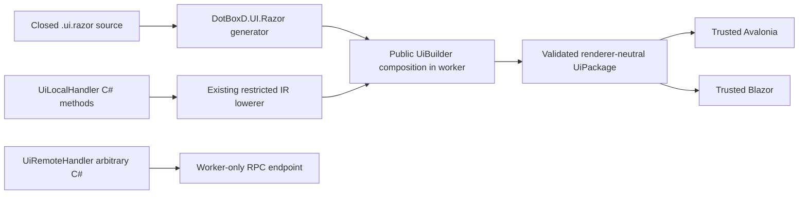

# Safe Razor authoring

`DotBoxD.UI.Razor` is an optional compiler frontend for worker-side UI composition. It emits
`IUiComponent.Render(UiBuilder)` using public APIs and the same `UiPackage` consumed by fake,
Avalonia and Blazor renderers. It does not use normal Razor component compilation. The host never
loads the plugin's authoring assembly or component IL.



Add `DotBoxD.UI`, `DotBoxD.UI.Razor` and `DotBoxD.Plugins.Analyzer` to the worker project. The Razor
NuGet package automatically registers `**/*.ui.razor` as additional files. Project-reference users
register their files explicitly and reference the Razor/analyzer projects with
`OutputItemType="Analyzer" ReferenceOutputAssembly="false"`, as in the sample plugin.

```csharp
[UiRazorComponent("Counter.ui.razor")]
public partial class Counter
{
    [UiLocalHandler]
    private static int Increment(int value) => value + 1;

    [UiLocalHandler]
    private static string Label(int value)
        => value.ToString(System.Globalization.CultureInfo.InvariantCulture);
}
```

```razor
@state int count = 0;
@kernel increment = Ui.Bind(Increment, count);
@kernel label = Ui.Bind(Label, count);

<UiVertical>
    <UiText Text="@Ui.Bind(label)" />
    <UiButton Text="Increment" OnClick="@Ui.Handle(increment, count)" />
</UiVertical>
```

State declarations initialize `int`, `bool`, `double`, `string`, or `items` slots with literals;
`items` starts with `[]` and carries shared `UiListItem` values in bounded patches. Kernel declarations
bind a `[UiLocalHandler]` method to zero or one scalar state input. These methods go through the
existing DotBoxD C# lowerer and runtime verifier, with the same host capabilities and effects.
Unsupported local C# produces `DBXU001`; it never becomes a remote handler implicitly. Complex worker
C# belongs in a separately declared `[UiRemoteHandler]` method and explicitly registered typed RPC.

| Syntax | Shared public primitive |
| --- | --- |
| `UiVertical`, `UiHorizontal`, `UiStack` | Stack with semantic orientation/spacing |
| `UiGrid`, `UiBorder`, `UiScrollViewer` | Bounded shared layout |
| `UiText`, `UiButton`, `UiTextBox`, `UiCheckBox` | Typed text and input properties |
| `UiSlider`, `UiProgressBar` | Finite numeric values and maxima |
| `@Ui.Bind(stateOrKernel)` | One-way typed property binding |
| `@Ui.TwoWay(state)` | TextBox.Text, CheckBox.Checked or Slider.Value |
| `@Ui.Handle(kernel, outputState)` | Explicit local restricted event kernel |
| `@Ui.Remote(endpointIdOrConstant)` | Explicit worker route; generated endpoint constants work |
| `UiWhen Condition="@Ui.Bind(boolean)"` | A bounded static subtree with shared Visible semantics |
| `UiItems Items="@Ui.Bind(rows)" @key="Key"` | Bounded keyed rows; identity comes from UiListItem.Key |
| `UiComponent Type="WorkerComponent" Arguments="state, kernel"` | Worker-side IUiComponent composition |
| `@resource icon = "host.icon";` and `UiImage Resource="@icon"` | Opaque shared resource grant |

Use one well-formed root and explicitly quoted attributes. Supported properties are `Text`, `Enabled`,
`Visible`, `Checked`, `Value`, `Maximum`, `Items`, `Horizontal`, `Spacing`, `Columns`, `Row`, `Column`,
`Padding`, and `Resource`, restricted to their corresponding primitive. Text literals are escaped
by each renderer; start a literal with `@@` to render a leading `@`. Source is bounded to 256 KiB, 2,000 nodes and 64 levels; host policy can impose
smaller package/materialization limits. Composition remains subject to host validation. Literal grid
columns use the same automatic cell placement as `UiBuilder.Grid`; bound columns require explicit
`Row` and `Column` on every child. `UiBuilder.Configure` overlays construction-time semantic properties
while retaining node IDs and event routes, so this generated composition can also be handwritten.

This is a closed authoring grammar. Normal Razor directives, `@code`, inline arbitrary expressions,
raw HTML, JS, CSS, CLR component resolution, RenderFragment/RenderTreeBuilder values, DI, HttpContext,
auth mutation, reflection, browser storage, attribute splatting, arbitrary event names and arbitrary
`foreach` templates produce deterministic `DBXR001` errors with a safe alternative. Put local
expressions in annotated scalar C# methods; use `UiWhen` for conditional visibility and `UiItems` for
bounded keyed collections. Hand-write worker-side `Render(UiBuilder)` for custom composition.

Generation is opt-in through `[UiRazorComponent]`. A hand-written `Render(UiBuilder)`, including an accessible inherited implementation, wins; set
`GenerateRender=false` to disable only rendering generation while retaining local-kernel/remote-endpoint
facets. Their existing `GenerateKernel` and `GenerateEndpoint` flags remain independent. Removing
attributes and hand-writing public builder/kernel APIs gives the same package hash and semantics;
this equivalence and incremental cache behavior are tested.
