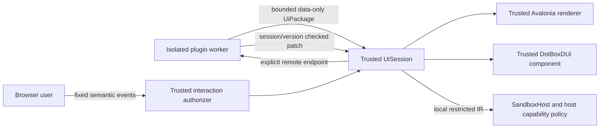

# Sandboxed Blazor

`DotBoxD.UI.Blazor` extends [sandboxed UI](sandboxed-ui.md) with a trusted .NET 10
Interactive Server renderer. It consumes exactly the same `UiPackage`, restricted kernels,
`UiSession`, versioned state, remote endpoints, host bindings, and structural policy as Avalonia.
The [Blazor host example](../samples/SandboxedUi/BlazorHost) reuses the existing plugin executable.
Blazor Hybrid can embed the same component with host-managed session/process lifetimes; it has
no JavaScript bridge. Interactive WebAssembly is outside this milestone.



The trusted host never loads plugin implementation or Razor component assemblies. Text is escaped
with Blazor text rendering. Package data cannot supply component types, render fragments, render-tree
callbacks, tag names, event attribute names, delegates, HTML, CSS, JavaScript, services, DOM handles,
or resource URLs. Rendering uses fixed host code and bounded numeric layout values. Images and
resource handles remain deferred with the common v1 schema; unknown primitives fail closed.
Navigation, uploads/downloads, browser storage, forms, custom CSS, and executable renderer extensions
are not exposed. Future extensions require a shared schema and explicit trusted host policy.

## Install and attach

```csharp
var renderer = new BlazorUiRenderer(uiPolicy);
var session = await uiHost.InstallAsync(package, renderer, connectionTransport, cancellationToken);
```

```razor
<DotBoxDUi Session="session" User="authenticatedBrowserPrincipal" Authorizer="hostAuthorizer" />
```

Use the same `UiPolicy` for the host and renderer. The renderer checks browser payload limits before
calling an authorization service; the session independently validates every committed write. Configure
Blazor circuit/SignalR message limits in the embedding web host to bound frames before deserialization.
For example, use `AddInteractiveServerComponents().AddHubOptions(options =>
options.MaximumReceiveMessageSize = 32 * 1024)` and select `MaxStringLength` within that frame budget.
The adapter adds no service registration requirement: construct the public renderer directly and
install it with the public `UiHost` API. `UiSession.Renderer` exposes the trusted adapter for host
composition and becomes null when teardown releases it.

`IUiInteractionAuthorizer.AuthorizeAsync` receives the trusted browser principal, bound session,
and declared semantic input. Implement it using the application's authorization policy. **A missing
authorizer denies all browser input**, including local kernels and two-way writes. Plugin sandbox
capability grants do not authorize a browser user. The plugin cannot select the principal or the
policy. A host should bind its authorization policy to viewer/plugin/session ownership and to the
sensitive event's semantic meaning. The example uses explicitly labeled demo identities; it is not
a login implementation.

Host code can implement its own component using `BlazorUiRenderer.Snapshot`, `Subscribe`, and
`SubmitAsync`. These are trusted integration primitives, never worker protocol fields. `SubmitAsync`
checks renderer/session ownership and returns bounded queue admission, not completion. Browser callbacks
capture the host's session object; no browser-supplied session ID is used to discover another session.

## Shared presentation contract

`IUiRenderer` materializes once after validation and initial kernel evaluation. Updates are atomic
batches of changed semantic property values, including authoritative corrections for rejected input.
Neither interface exposes Blazor or Avalonia types. `UiRendererCapabilities` advertises supported
primitive IDs and semantic `UiFeature` values. `UiHost` rejects unavailable primitives or explicitly
required features before executing/materializing a package; installation failure disposes the adapter.
`UiPackage.RequiredFeatures` and `OptionalFeatures` are bounded, closed declarations. Optional absence
is permitted so authors can ship a core fallback structure. V1 has a static tree and does not select
conditional fallback trees automatically. Feature declaration order is canonicalized; older v1 JSON
without declarations imports as empty declarations.

| Shared primitive | Trusted Blazor output |
| --- | --- |
| Stack | flex column/row with bounded spacing |
| Grid | CSS grid with bounded columns and attached row/column placement |
| Border | bordered container with bounded padding |
| Text | escaped span |
| Button | button with a declared click route |
| TextBox | text input; two-way `oninput` |
| CheckBox | labeled checkbox; two-way Boolean `onchange` |
| Slider | range input; two-way finite Number `oninput` |
| ProgressBar | progress element |
| ScrollViewer | overflow container |
| Items | static children or escaped text rows keyed by shared row identity |

Disabled and hidden nodes, including descendants of disabled/hidden containers, reject semantic
input inside `UiSession`. This holds even when a browser forges an event for an existing handler.
Accepted nonempty writes increment the shared version exactly once. State-only updates retain the
package/tree installation; keyed row reordering uses Blazor keys. Earlier echoes and rejected-edit
corrections cannot replace newer queued browser edits.

## Viewers and lifecycle

Create one renderer and one `UiSession` per viewer/component. The adapter permits one active viewer
subscription; attaching a second requires an independent session. IDs/state/routes are installation
scoped. Remote snapshots and replies retain shared optimistic version checks; stale replies never
silently overwrite newer input. Input rate, payload length, authorization concurrency, pending queue,
remote concurrency, remote deadlines, state bytes, and materialized rows have explicit bounds.

`DotBoxDUi` owns its session by default: replacement, navigation, component disposal, or circuit
expiration detach the subscription and dispose the session. A trusted host may set
`DisposeSessionOnDetach="false"` to retain it and later attach a new component. Temporary Interactive
Server circuit disconnects follow Blazor's configured circuit retention: the session remains authoritative
until reattachment or circuit expiration. Configure retention in the web host; the adapter creates no
timers or persistent circuit registry. Hybrid hosts choose their native page lifetime.

Worker disconnect must be connected to session disposal by the host-owned IPC connection adapter,
including while idle. The example does this through the same `UiSessionConnection` as the Avalonia
sample. Disposal cancels authorization and remote waits, closes admission, clears renderer data/queued
input/subscriptions, and rejects late events/patches. Reconnecting installs a fresh session ID.

The shared conformance sequence runs on fake, Avalonia, and Blazor adapters. It verifies local and
remote events, two-way input, state versions, keyed rows, enabled/visible ancestors, stale/foreign
patches, and teardown. Blazor tests additionally dispatch actual component event callbacks, verify
HTML escaping and keyed render-tree moves, and cover authorization, malformed input, bounded queues,
input ordering, and cancellation. Both CI platforms run the generated-plugin process smoke with two
independent viewers, host score binding, idle crash, and reconnect.

## Razor authoring decision

Safe Razor authoring is deferred. This change ships the required renderer and preserves the existing
C# authoring frontend and its deterministic unsupported-local-code diagnostics. Normal plugin Razor
components are executable managed code and cannot be loaded by the trusted host. A later safe Razor
compiler must lower a closed supported syntax to the existing `UiPackage` and existing restricted IR;
it must not add a parallel component/state/event runtime.

## Measurement

`UiBlazorBenchmarks` measures 10/100/1,000 static nodes and keyed rows, state-only rerendering, browser
text admission, local clicks, 100-slot patches, keyed reordering, and component attach/detach with
BenchmarkDotNet's allocation diagnostics. No performance improvement is claimed.

```sh
dotnet run --project benchmarks/DotBoxD.Kernels.Benchmarks -c Release -- --filter '*UiBlazorBenchmarks*'
```
